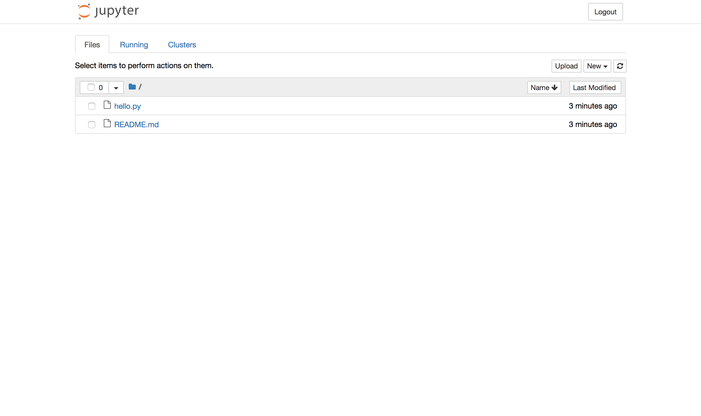

# From Zero to Binder!

This document will walk you through taking a repository containing Python
code and adding to it to make it runnable with a service like mybinder.org.

One of the big hurdles to trying out other people's code is reproducing the
exact environment that the code requires to run. Writing instructions that
are correct for all possible cases is very hard. As a user applying imperfect
instructions to your particular setup is very hard. Often it is also not clear
where the "bug" is when things don't work. Should the instructions have mentioned
that setting that obscure environment variable to an obscure value would break
the instructions? Should you as user have know this? And will either the author
or the user ever think of checking for obscure things like this?

One way to solve this is the approach BinderHub (the software behind
mybinder.org) takes. The authors provide machine-readable instructions for how
to construct the environment. A machine will execute these instructions and if
they do not work, it is clear the instructions need updating. The construction
of the environment starts from the same "base" for every possible project, which
makes it easier for users to help out with fixing the instructions.


## Creating a repository to "binderize"

To get started let's create a new repository that we can use during this
exercise to demonstrate how to "binderize" a repository.

What is "binderizing" a repo? A (not so great) name for creating the instructions
that BinderHub can understand to create the environment your code needs.

To do:

1. Head over to github.com and create a new repository called "my-first-binder"
1. Create a file called `hello.py` via the web interface with `print("Hello from Binder")`
  on the first line


## Launch your first repository

You jsut created a repository that is compatible with Binder! Before we explain
how this can be, head over to https://mybinder.org and see for yourself.

The interface you see on mybinder.org let's you specify the repository you want
to have started.

To do:

1. Type the URL of your repository into the "GitHub repo or URL" box (should be
    something like https://github.com/<YOURGITHUBNAME>/my-first-binder/)
1. As you type the URL the webpage will generate a link you can share with
   others in the "Copy the URL below..." box. It should look something like: https://mybinder.org/v2/gh/<YOURGITHUBNAME>/my-first-binder/master
1. Copy it, open a new tab and visit that URL

When you visit a URL like https://mybinder.org/v2/gh/<YOURGITHUBNAME>/my-first-binder/master
you will see a big spinner like this:


In the background several things are happening while you wait. BinderHub is:
* fetching your repository from github.com,
* analysing the contents of the repository,
* creating a Docker image based on what it finds,
* launching the newly created image for you in the cloud, and
* finally connecting you to it via your browser.

If everything went smoothly you should be greeted by a page that looks like
this:



One of the default dependencies that is installed for you is Jupyter which
provides this interface for you.

To see your code run click (on the far right next to the "Upload" and
"Last Modified" buttons) "New -> Terminal". This will open a new tab with a
terminal. To run your code type `python hello.py`.


## Using other libaries

It was easy to get started but so far the environment which is created is pretty
barebones. Let's add some dependencies.

The tool that analysis your repository to find what dependencies need to be
installed looks for files that are already in use by the respective programming
language communities. It checks for Python dependencies by looking for a
`requirements.txt` file.

To do:
1. in your repository on GitHub create a file called `requirements.txt`
1. add a line to `requirements.txt` that reads `numpy==1.14.5`
1. after adding the file and checking its name for typos
1. visit https://mybinder.org/v2/gh/<YOURGITHUBNAME>/my-first-binder/master again
  in a new tab

You will see the big spinner again. While the spinner is spinning click on the
big horizontal grey bar that reads "Build logs". It will unfold and let you watch
the progress of your container being built. Looking at this is useful when
your build fails or something you think should be installed does not get installed.

Once your repository launches you should be greeted by the now familiar file
browser view provided by Jupyter.

To check that Numpy was installed and is ready for use open a new notebook
(click New -> Python 3). Type the following code into a cell of the new notebook:

```
import numpy
numpy.random.rand()
```

If you run this cell you will see a random number printed out.


## Sharing your work

Binder is all about sharing your work. There are two ways to let others use
your repository on mybinder.org:

1. share the https://mybinder.org/v2/gh/<YOURNAME>/my-first-binder/master URL
  with people
1. visit https://mybinder.org, type in the URL of your repository and copy
  the Markdown or Restructure Text snippet. The snippet will render a nice
  badge that people can click

To do:
1. add the Markdown snippet to the README.md in your GitHub repository
1. click the badge to make sure it works


## Questions?

Brief pause for questions


## 
